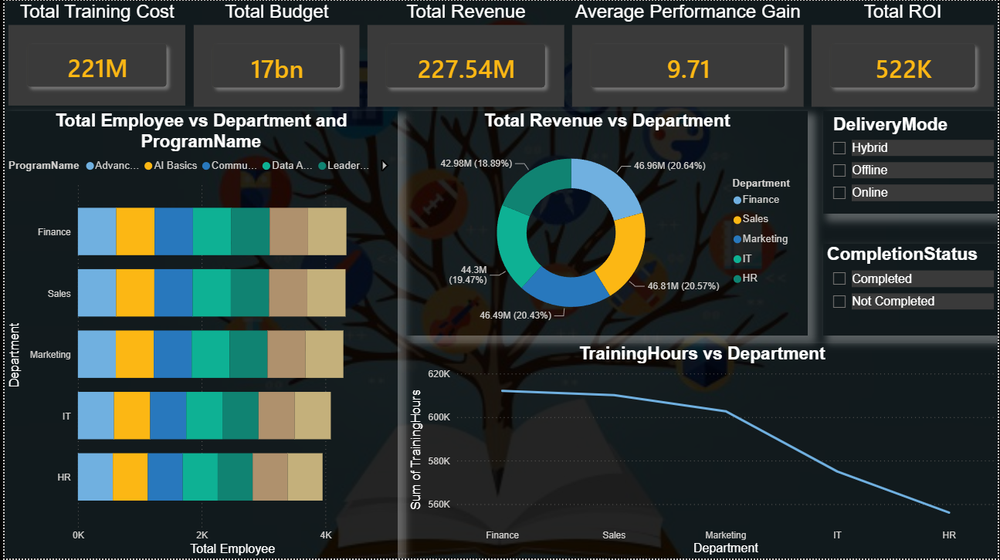
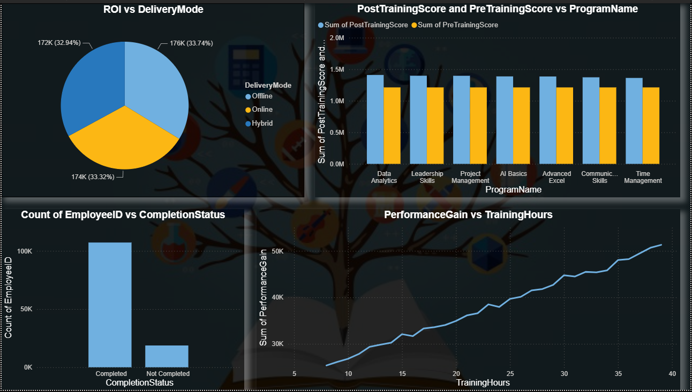

# 📊 Learning and Development Analytics Dashboard

An interactive **Power BI Dashboard** designed to analyze Learning & Development (L&D) data, evaluate employee training effectiveness, measure ROI on training investments, and support strategic decision-making through data-driven insights.

---

## 📌 Project Overview

This project focuses on analyzing Learning and Development (L&D) data to evaluate employee training effectiveness, optimize organizational learning strategies, and improve workforce performance through interactive dashboards. It provides insights into employee engagement, training effectiveness, department-wise investment, and learning outcomes.

---

## 🎯 Project Objectives

- Analyze employee and department performance with respect to training investments.
- Evaluate learner engagement, feedback, and training effectiveness.
- Compare different training delivery methods (Online, Offline, Hybrid).
- Measure ROI generated through employee development programs.
- Support strategic decision-making using SWOT and Root Cause Analysis.

---

## 📊 Dashboard 1 – Overview Analysis

### Features

- Training Performance Overview
- Employee Participation Analysis
- Department-wise Learning Performance
- Learner Engagement Score
- Training Effectiveness Metrics
- Performance Improvement Analysis

---

## 📈 Dashboard 2 – Methods, Strategies & Process Analysis

### Features

- Delivery Mode Analysis (Online, Offline, Hybrid)
- Department-wise Training Investment
- ROI Analysis
- Learning Process Evaluation
- Opportunity & Threat Analysis
- Training Strategy Performance

---

## 🎯 Dashboard 3 – Strategic Decision Making & Process Optimization

### Features

- SWOT Analysis
- Fishbone (Ishikawa) Diagram
- Root Cause Analysis (RCA)
- Strategic Recommendations
- Process Improvement Opportunities

---

## 💡 Key Insights

- Department-wise investment impact on employee performance.
- Comparison of Online, Offline, and Hybrid training programs.
- Employee engagement and feedback analysis.
- ROI evaluation for learning initiatives.
- Identification of key issues affecting training effectiveness.
- Data-driven recommendations for continuous improvement.

---

## 🛠️ Tools & Technologies

- Microsoft Power BI
- Power Query
- DAX
- Microsoft Excel
- Data Modeling
- Business Intelligence
- Data Visualization

---

## 📈 Project Outcome

The dashboard enables organizations to:

- Monitor employee learning performance.
- Improve training effectiveness.
- Optimize learning investments.
- Increase employee engagement.
- Make strategic, data-driven decisions.
- Maximize ROI on Learning & Development programs.

---

## 🚀 Skills Demonstrated

- Power BI
- Data Visualization
- Dashboard Design
- Data Modeling
- Power Query
- DAX
- Business Intelligence
- KPI Reporting
- SWOT Analysis
- Root Cause Analysis (Fishbone Diagram)
- ROI Analysis

---

## 📷 Dashboard Screenshots

### Dashboard 1 – Overview

---

### Dashboard 2 – Methods, Strategies & Process

---

